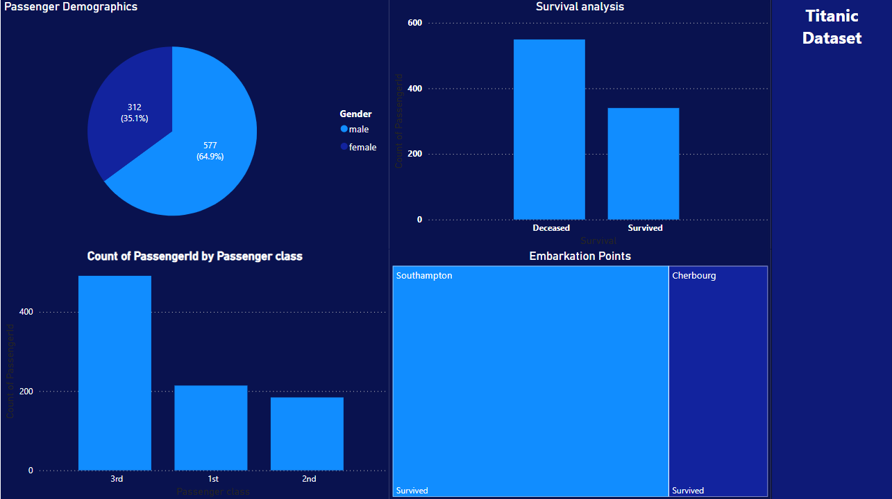

# 🚢 Titanic Dataset Exploration & Dashboard 📊  

## 🎯 Project Overview  
All aboard the Titanic dataset! 🛳️ In this project, I dove into the famous Titanic dataset and performed an in-depth analysis using **Power BI**. From data cleaning to creating insightful visualizations, I uncovered patterns in survival rates, passenger demographics, and ticket classes. The result? A sleek, interactive Power BI dashboard that tells the story of the Titanic passengers in a visually engaging way! ✨  

  

---

## 🛠️ Tools Used  
- **Power BI**: For data cleaning, modeling, and creating interactive dashboards.  
- **Titanic Dataset**: The famous dataset containing information about passengers, their demographics, and survival outcomes.  

---

## 🛠️ Skills & Functions Demonstrated  
### Power BI Functions: 🔍  
- **Data Cleaning**:  
  - `Replace Values`: Fixed inconsistent data and handled missing values.  
  - `Split Column`: Split columns like "Name" into first and last names for deeper analysis.  
  - `Trim` and `Clean`: Removed unwanted spaces and non-printable characters.  
  - `Remove Duplicates`: Ensured unique records for accurate analysis.  

- **Data Modeling**:  
  - **Relationships**: Established links between tables using primary and foreign keys.  
  - **Calculated Columns**: Created new columns, such as `FamilySize` (`Siblings/Spouses Aboard` + `Parents/Children Aboard`), to derive additional insights.  
  - **Measures**: Defined metrics like `Survival Rate` using `DAX` formulas:  
    ```DAX
    Survival Rate = DIVIDE(COUNTROWS(Survived), COUNTROWS(PassengerID))
    ```

- **Visualizations**:  
  - Used **Slicers** for interactivity (e.g., filter by gender, class, or survival status).  
  - Created **Bar Charts**, **Pie Charts**, **Clustered Column Charts**, and **Line Graphs** to represent data trends.  
  - Designed a clean, user-friendly dashboard with easy-to-navigate filters and visuals.  

---

## 🌟 Key Insights & Features  
- 👩‍👩‍👧‍👦 **Survival Analysis**: Explored survival rates based on passenger demographics such as age, gender, and class.  
- 🎟️ **Class Breakdown**: Analyzed the distribution of passengers across different ticket classes and how class impacted survival rates.  
- 🌍 **Passenger Demographics**: Gained insights into the age and gender distribution of passengers.  
- 🚨 **Survival Factors**: Highlighted key factors influencing survival, such as family size, embarkation point, and ticket class.  


)  

---

## 🚀 How to Explore  
1. 🖱️ Open the **Power BI Dashboard** file included in the repository.  
2. 🛠️ Explore interactive visuals and slicers to uncover insights about Titanic passengers.  
3. 📂 Check out the data transformations and modeling steps used to prepare the dataset.  

---

## 🎉 Let’s Dive In!  
This project is a testament to the power of **Power BI** in transforming raw data into actionable insights. 🌟 Whether you're interested in survival trends or understanding passenger demographics, this dashboard has it all! Ready to explore the story of the Titanic passengers? 🌊📈  
